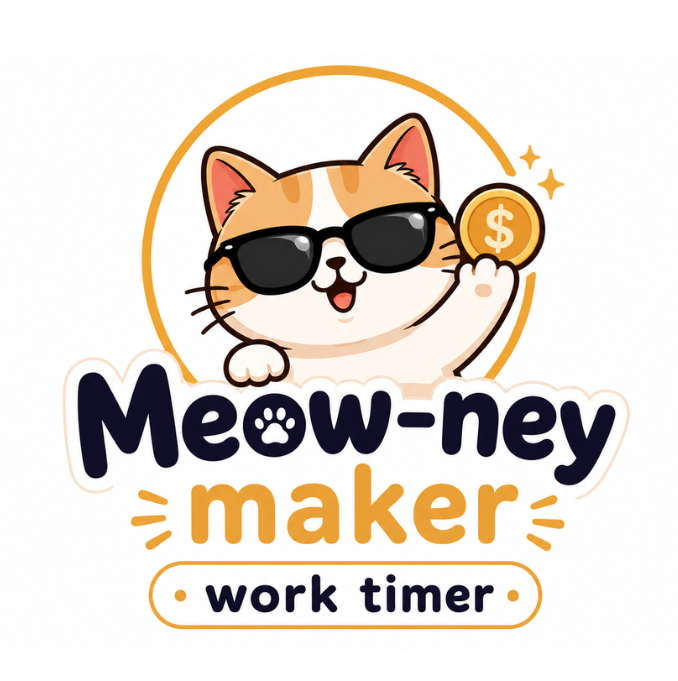

<div align="center">



<h1>Meow-ney Maker</h1>

<b>Welcome to HELL ✨ ...but at least you're getting paid!</b>

<p>
  
  
  
  
</p>

<p><i>A work timer that counts your pay by the second, then writes the day down for you.</i></p>

</div>

<br>

## 🐱 What it is

Meow-ney Maker turns a workday into something you can watch. Tell it what you earn, clock in, and your pay counts up second by second while a pixel cat works alongside you. Clock out and the day gets written down — the hours, the money, what you spent, how it felt, and what still needs doing.

It's a work tracker for people who'd rather see the day add up than just get through it.

<br>

## 🐾 Features

<table>
<tr>
<td width="50%" valign="top">

### ⏱️ Live salary timer

Enter your monthly salary, daily hours, and working days. The app works out what you earn per second and counts it live while you work.

Close the tab, refresh, come back later — the shift is still running where you left it.

</td>
<td width="50%" valign="top">

### 📊 Dashboard

Total earned, total time worked, days worked, shifts logged, best day.

Earnings for any month or year as a line chart, the last seven days as bars, and every shift in a table you can sort, search, and page through. One button prints it all as a PDF.

</td>
</tr>
<tr>
<td width="50%" valign="top">

### 📖 Diary

One open book per day. The left page fills itself in with the shifts you worked and lets you list what you spent — earned, spent, and net, side by side.

The right page is yours: a cat mood, tags (Work, Play, Rest, Study, Family, Special, or your own), and a note. The month calendar beside it shows every day's mood and tag at a glance, and filters down to just the sad days, or just the ones tagged Study.

</td>
<td width="50%" valign="top">

### ✅ Todo boards

One board per list — Study, Home, Work, whatever you need.

Colour-code the cards, star what matters, tick things off. Each list shows pending, finished, and how far through you are. Pin the three lists you live in so they stay first.

</td>
</tr>
<tr>
<td width="50%" valign="top">

### 👤 Accounts &amp; sync

Sign in with email or Google and everything follows you between devices — shifts, diary, tasks, theme, even a shift that's still running.

No account? The timer still works; the day stays in the browser.

</td>
<td width="50%" valign="top">

### 🎨 Four palettes

Midnight, peach, mint, lavender — the whole app recolours, cat included.

Glass cards on a floating glitter background. Every sprite and icon is hand-drawn pixel art, and the cat bounces while you grind, then throws on the DJ set when you clock out.

</td>
</tr>
</table>

<br>

## 🗂️ Project structure

```
Project_Meow-ney_Maker
├── index.html              Page shell; sets the saved theme before first paint
├── public/
│   └── favicon.png         The logo
└── src/
    ├── main.jsx            Entry point
    ├── App.jsx             Routes, session, theme, password recovery
    ├── Nav.jsx             Tab bar, theme picker, login/profile buttons
    │
    ├── Timer.jsx           Clock in/out, live earnings, shift history
    ├── Dashboard.jsx       KPIs, line + bar charts, sortable shift table, PDF
    ├── Diary.jsx           Month calendar and the day's open book
    ├── Todo.jsx            Task lists, cards, progress, list settings
    │
    ├── Login.jsx           Email and Google sign-in, password reset
    ├── Profile.jsx         Display name, avatar upload, log out
    ├── PasswordField.jsx   Password input with a show/hide toggle
    │
    ├── calc.js             Pure money/time math — rate, totals, chart series
    ├── calc.test.mjs       Self-check for the math
    ├── db.js               Every Supabase read/write, in one place
    ├── supabase.js         Client; null when unconfigured, so guests still work
    ├── dialog.js           In-page alert/confirm/prompt/toast, promise-based
    ├── pixel.jsx           Hand-drawn SVG cat + icons, and the theme switcher
    └── style.css           The whole look: palettes, glass, glitter, print
```

**Tables:** `user_preferences` · `active_sessions` · `work_sessions` · `diary_entries` · `todo_categories` · `todos`

<br>

## 🛠️ Tech stack

| | |
|---|---|
| **Frontend** | React 19 · React Router 7 · Vite 8 |
| **Backend** | Supabase — email + Google auth, Postgres, avatar storage |
| **State** | React hooks only — no Redux, no state library |
| **Storage** | Supabase when signed in, `localStorage` for guests |
| **Charts** | Hand-rolled inline SVG — no chart library |
| **Art** | Hand-drawn pixel sprites as inline SVG — no image assets |
| **Styling** | One plain `style.css`, CSS variables per theme |
| **Type** | Press Start 2P · Pixelify Sans · Space Mono |
| **PDF** | The browser's own print dialog + a `@media print` block |

<br>

<div align="center">
<sub>Amounts are in RM · Made with 🐱 and questionable work-life balance</sub>

<sub>© 2026 Elaine · All rights reserved</sub>
</div>
